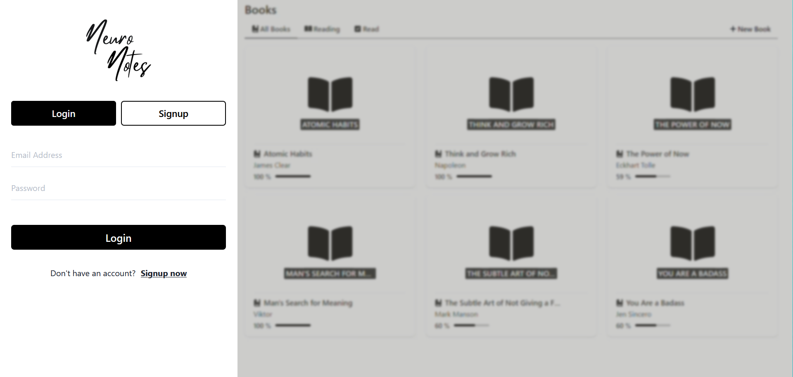

## NeuroNotes is an application based on the "second brain" methodology

Much like it sounds, building a “second brain” is about creating a system
outside your physical skin-and-bone bodily boundaries 
for storing, organising, and eventually transforming information. 

### Features Include:
- **Login / Signup options**
- **Made possible with JWT and auth middleware**
- **Toast error messages when email already exists / incorrect login details**

