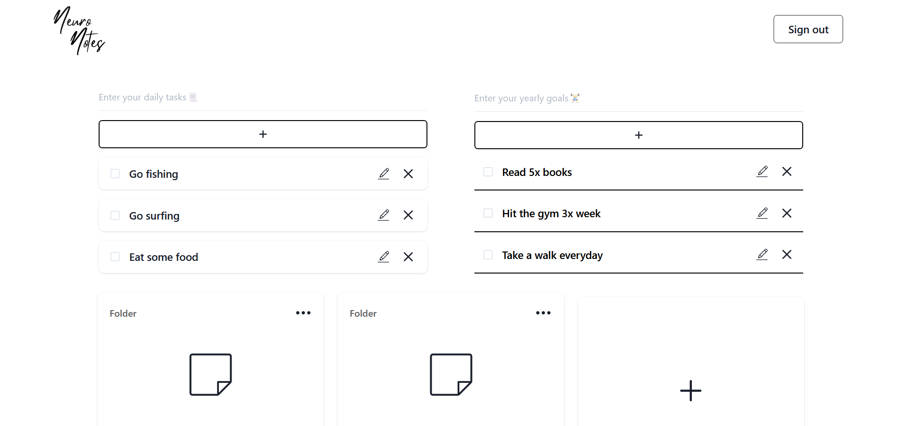
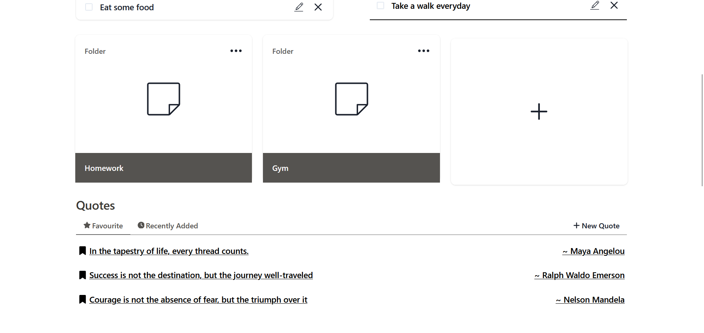
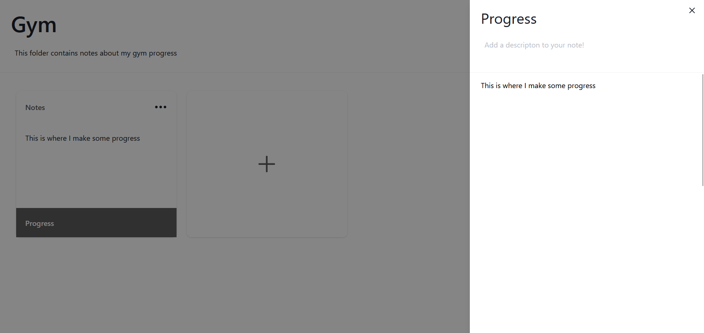
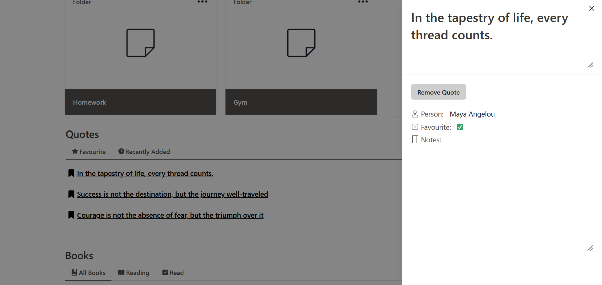
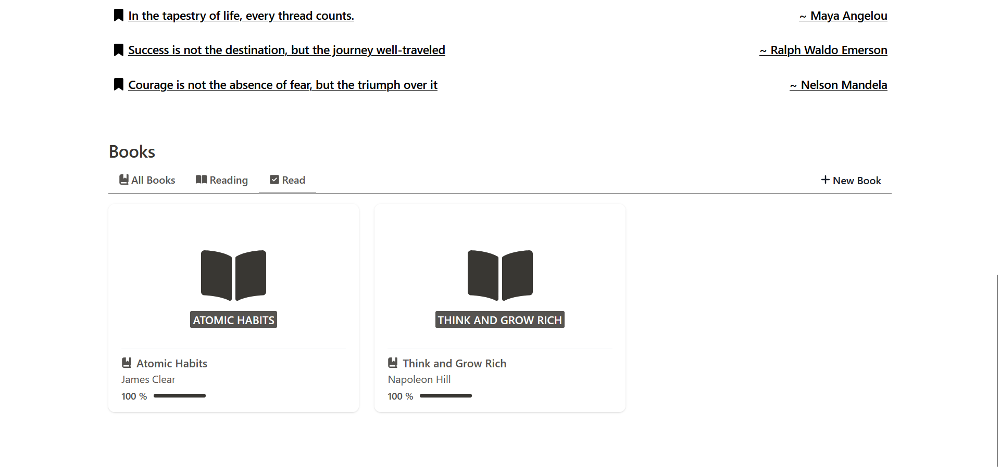
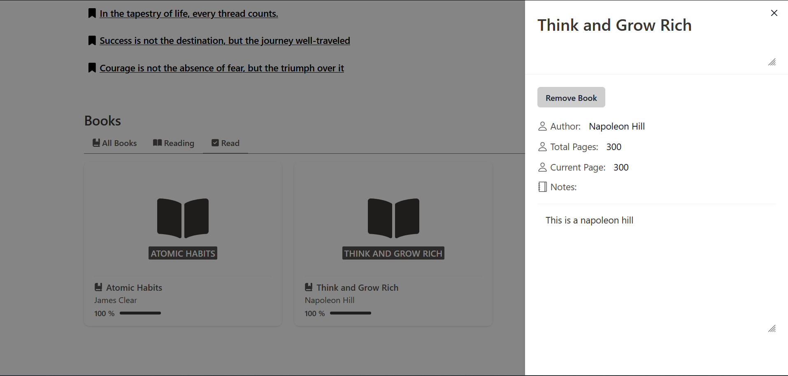

## NeuroNotes is an application based on the "second brain" methodology

Much like it sounds, building a “second brain” is about creating a system
outside your physical skin-and-bone bodily boundaries 
for storing, organising, and eventually transforming information. 

### Features Include:
- **Login / Signup options**
- **Made possible with JWT and auth middleware**
- **Toast error messages when email already exists / incorrect login details**

- **User can fill in daily takes**
- **User can also fill in longer term goals**
- **Full CRUD functions possible to both goals and tasks**

- **User has the option to create folders**
- **Inside the folders users can store notes that belong to that folder**
- **Full CRUD functions possible with folders**

- **User has the option to create notes inside the folders**
- **Notes can be openend to edit.**
- **When closed and content has changed then it will send a request to the backend to update contents**
- **Full CRUD functions possible with notes**

- **User has the option to store quotes**
- **You can filter the notes based on favourites or recently added**
- **Full CRUD functions possible with quotes**

- **User has the option to store books**
- **Books can be filtered based on which page you are on**
- **Under max book pages = reading, if your current page is the same as max amount of pages then it filters the book to read.**
- **"All books" just gets all the books you are reading / have read**

- **Books have full CRUD functions**

## Tech Stack

### Frontend:
- **Typescript**
- **React**
- **ChakraUI**
- **React Query**
- **Axios**
- **Vercel**

### Backend:
- **Javascript**
- **Node.js**
- **Express.js**
- **MongoDB**
- **Mongoose**
- **Render**
- **bcrypt**
- **JWT**

# Thank you for checking out NeuroNotes

